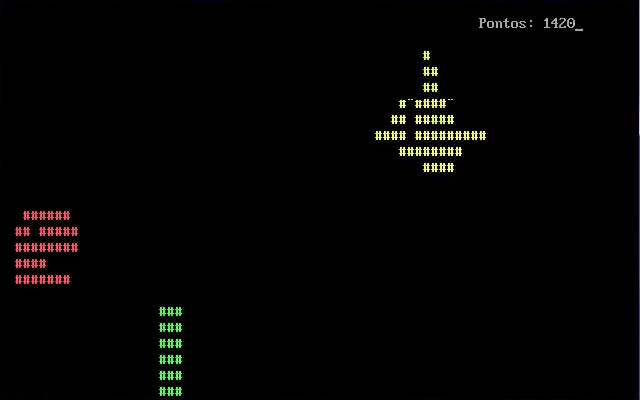

# Chrome Dino Game in Assembly

## Pictures

PS:
- Iniciar jogo == Start game
- Sair == Exit
- Pontos == Points

## Introduction
This is a project for the Computer Architecture subject in the course of Electrical and Computer Engineering, coded in 2020.

It's the Google Chrome's Dino Game, but coded for the Intel 8086 processor, 100% in Assembly. Game I'm talking about: https://chromedino.com/.
It's not perfect, but I think it's pretty cool xD. Was very cool to make too haha. It has sound and plays I want to break free from Queen while you play. To play it, use DOSBox (use the settings file I provide if you'd want), and just run it normally like any other program or game. PS: it also tries to simulate gravity when the dinossaur jumps.

By the way, the "dinossaur" in the game is just the head because it would give too much work to draw it in more resolution in the graphics mode. So we chose to go for the text mode and draw only its head (Pac-man? No. Dino-man 😂).

Hope it's not too much Alien Language to be understandable haha. Also, it was in Portuguese, so I translated it to English. Hopefully I translated everything right.

Hope anyone that sees this likes it haha. Might help someone by giving some ideas too! If you have any questions, just throw an Issue or a Discussion or something.

I'll also provide:
 - Already compiled binaries on a release;
 - My compilation environment with Sublime Text, a compilation assistant, and MASM 9 (or 6.15, which works perfectly too);
 - Just because I have it here, I'll share too a theme for EMU8086 for Monokai colors and my settings for it to look as much as possible as Sublime Text, and also files that put Sublime Text understanding the MASM Assembly syntax (I got them from NASM syntax and changed somethings myself for it to work better with MASM - credits for the original version go for https://github.com/13xforever/x86-assembly-textmate-bundle !);
 - My DOSBox 0.71 settings to get the game running with sound

## License
This project is licensed under Apache 2.0 License -  [http://www.apache.org/licenses/LICENSE-2.0](http://www.apache.org/licenses/LICENSE-2.0).
